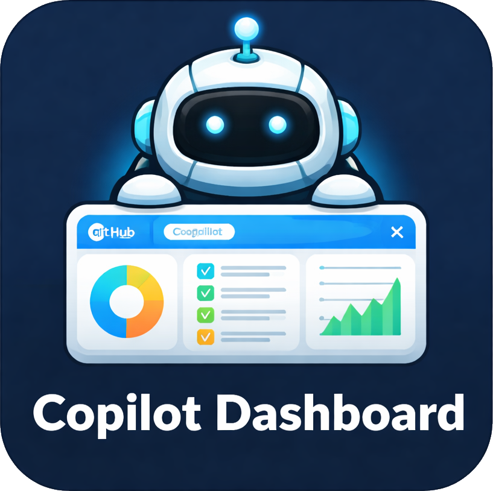

<div align="center">




Overview of your GitHub Copilot customization files inside VS Code.


[Overview](#overview) • [Features](#features) • [What-it-scans](#what-it-scans) • [Getting-started](#getting-started) • [Development](#development)

</div>

## Overview

Copilot Dashboard adds a dedicated Activity Bar view that shows the Copilot customization files available in your workspace and selected user-level folders. It gives you a single place to inspect custom agents, instructions, prompts, skills, hooks, and MCP servers, then open any file with one click.

The extension is built as a lightweight webview-backed explorer for teams working with Copilot customization primitives and VS Code agent workflows.

> [!NOTE]
> The current version focuses on discovery and navigation. It does not edit, validate, or generate customization files from the dashboard itself.

## Features

- Dedicated Copilot Dashboard view in the Activity Bar.
- Scans workspace and selected user-level Copilot customization locations.
- Groups results by type: agents, instructions, prompts, skills, hooks, and MCP servers.
- Shows item counts, descriptions, file locations, and model metadata when available.
- Opens files directly from the dashboard.
- Refresh command in the view title to rescan the workspace.
- Works with standard `.github/` conventions and common Copilot file layouts.

## What It Scans

### Workspace files

| Type | Locations |
| --- | --- |
| Agents | `.github/agents/*.md`, `.github/agents/*.agent.md`, `.claude/agents/*.md` |
| Instructions | `**/*.instructions.md`, `.github/copilot-instructions.md`, `AGENTS.md` |
| Prompts | `.github/prompts/*.prompt.md` |
| Skills | `.github/skills/*/SKILL.md` |
| Hooks | `.github/hooks/*.json` |
| MCP servers | `mcp.json`, `.vscode/mcp.json` |

### User-level files

| Type | Locations |
| --- | --- |
| Agents | `~/.copilot/agents/*.md` |
| Skills | `~/.copilot/skills/*/SKILL.md` |

> [!TIP]
> Instructions are discovered broadly across the workspace, so the dashboard can surface both conventional `.github/instructions/*.instructions.md` files and custom instruction files stored elsewhere in the repo.

## Getting Started

### Use the extension locally

1. Install dependencies:

```bash
npm install
```

2. Start the TypeScript watcher:

```bash
npm run watch
```

3. Press `F5` in VS Code to launch an Extension Development Host.
4. In the new window, open a workspace that contains Copilot customization files.
5. Select the Copilot Dashboard icon in the Activity Bar.
6. Expand a section and click a file entry to open it.

### Use the dashboard

The dashboard presents a compact stats grid at the top, followed by collapsible sections for each customization type. Sections containing items open by default, and the refresh action rescans the workspace when files change.

## Development

### Stack

- VS Code extension API
- TypeScript
- Webview UI rendered from `src/extension.ts`
- ESLint for linting
- `@vscode/test-cli` and `@vscode/test-electron` for extension tests

### Scripts

```bash
npm run compile
npm run watch
npm run lint
npm test
```

### Project shape

```text
src/
	extension.ts
	test/
		extension.test.ts
media/
	icon.svg
```

## Notes

- Requires VS Code `^1.110.0`.
- The extension currently contributes one Activity Bar container, one webview view, and one refresh command.
- There are no contributed settings yet.
- Test coverage is still at the starter-template stage, so behavior is currently documented more thoroughly than it is automated.
